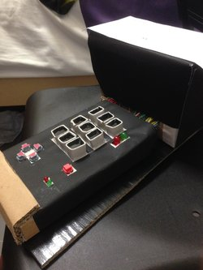
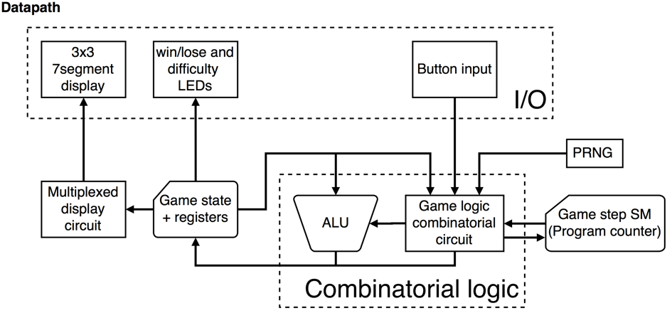

# 10!

A hardware game inspired by [2048](http://2048game.com/).

## Game Description

### 1.Overview

This is an overview of the game. The above pictures are the game interface.
The interface components consist of 9 seven-segment led displays (in 3x3 square),
5 buttons (4 grey buttons for directions and red button for resetting), 2 big
led lights (at the top right corner) for signaling win/lose, and 2 small led
lights (at the bottom right corner) for display of game mode.

### 2. Getting Started

The game will start when player presses reset button. The grid will display all "10"
cells (see picture below)

Player then will choose game mode by pressing one of the direction button:
- UP: Easy Mode (both small led lights will be off)
- LEFT: Normal Mode (small green led light will be on)
- RIGHT: Hard Mode (small red led light will be on)
- DOWN: Extreme Mode (both small led lights will be on)

Player can then proceed to play the game. The game rules will be explained in the
next section of the documentation.

### 3. How to Play

If you are familiar with [2048](http://2048game.com/), this game is another version
of it with objective of getting to 10 and different combination of tiles. Instead
of addition, when 2 tiles are combined in 10!, a new tile with incremented value
(+1) will appear in place.

In case you are not familiar with [2048](http://2048game.com/), here is the full
explanation how to play 10!:

**Objective:** Use your arrow keys to move the tiles. When two tiles with the same
number touch, they merge into one! In this attempt, try to get a block of 10 and
you win the game

**Detail Interaction:** When a direction key is pressed, all tiles that are on
display will be moved to the corresponding direction all the way till they are
blocked by the wall or another tile. When 2 tiles with the same number hit each
other, they will be combined into one tile with incremented (+1) value (e.g.
2+2->3 or 5+5->6). A new tile will spawn randomly whenever you move the tiles
with direction buttons so you will need a bit of luck to win 10!

**Win/Lose Condition:** When any of the tile is incremented to 10, the game will
automatically stop, the big green led light on top right corner will light up,
and you will be declared winner. If you fail to increment any of the tile to 10
before running out of space for new tile to spawn, the game will also stop, the
big red led light on the top right corner will light up, and it's a lost game.

Have fun playing! :boom: :tada: :confetti_ball:

## In-depth Technical Analysis

### 1. Overall datapath:

The high level datapath is shown above. The processor receives input from buttons,
which are fed into the game logic circuit. Blocks with an angled cut at top left
represent registers rather than circuit blocks.

The game logic circuit consists of the main bulk of the circuit. As an analogy
to a CPU, the game logic combinatorial circuit functions similarly to the
control unit. It directs what needs to be sent to the ALU, read/written into
registers and manages the game step state machine. Miscellaneous non-ALU operations
are also included in this circuit.

The game step state machine acts like a program counter in a CPU. It stores the
state of which instructions should be carried out. Unlike a CPU, there is no
memory address, each state directly corresponds to a specific instruction.
Sub-step state machines are also considered part of this portion (elaborated in
the game_step state machine part).

The game state + registers acts like the register file of a CPU. The working
data of the program is stored is these registers.

Unlike a Von Neumann machine, output is directly driven by the register memory
instead of being controlled by the logic circuit. There is no shared bus.
There is a multiplexed display circuit to display the 3x3 array of 7 segments,
to reduce number of wires to the mojo.

This design was chosen due to its simplicity and effectiveness in modularising
blocks of circuits. Thus, we can work on specific parts independently and then
bring the components together to use. The adoption of a control unit + program
counter style of operation allows the logical steps to be very modular and easy
to work with.

### 2. Overall finite state machine design

The game state machine design is designed to run sequentially, effectively being
a large loop. Each state represents a logical step in the game process. The ALUFN
operations used in each state are shown at the top right of each state (in diagram).
6 ALUFNs are used.

However, not all states can be completed in a single clock cycle, thus some states
have substates in them to run multiple sequential operations to complete the state.
States with substates are represented by having a rectangle in the state oval (in diagram).
On each transition, the required variables for the next step have to be initialised.
eg. SELECT_POS uses row_index and col_index to iterate through the game_state,
thus SELECT_NUM has to set these 2 registers to 0.

The game starts at the WAIT_START to wait for difficulty input to initialise
variables (stored in registers).
The game loops in the right-side column until the win or lose conditions are met,
then it breaks out of the loop.
Both WIN and LOSE are halting conditions.

Brief description of looping states:
- COUNT_EMPTY: Counts the number of empty cells in the game board and stores it
in a register.
- CHECK_LOSE: If the number of empty cells is 0, it is not possible to continue
the game. The player loses. Otherwise, simply continue.
- MAKE_RAND1: Generates a random number for selecting the new number to spawn
from an array of numbers. This array is fixed at size 8, so only 3 bits are
needed to index.
- MAKE_RAND2: Generates a random integer for selecting the location to spawn
the new number in.
- SELECT_NUM: Uses number from MAKE_RAND1 to select new number to spawn from a
pre-set array of numbers.
- SELECT_POS: Uses number from MAKE_RAND2 to choose from the empty slots to
spawn the new number.
- ADD_NUM: Actually creates the new number from SELECT_NUM in the position from
SELECT_POS in the game state.
- WAIT_INPUT: Waits for user to press one of the arrow buttons to start the loop
again.
- SHIFT: Does the board shifting operation
- CHECK10: If there are any winning numbers of the board, the player wins.
Otherwise, simply continue.

By adopting a sequential style of processing, conceptualisation of the steps
needed is greatly simplified. Each state only needs to know what the required
variables for the next state to initialise are. Otherwise, the states are
effectively independent and modular.

Although some steps could be done in parallel to make the calculations faster
without additional cost, we decided to always use serial processing since it
would be simpler to plan and code. Furthermore, the entire cycle runs so fast
that speed does not matter (the loop takes 91 cycles, or 1.82ms. The multiplexed
display refreshes slower than this!).

### 3. RandomInt Datapath

The pseudo random number generator provided by the mojo generates random bits.
However, in MAKE_RAND2, we need to select from the empty cells. Thus, we need to
generate random integers within a range that we control. The following diagram
shows the datapath to generate the random integer.

The pseudo random number generator provided by the mojo generates random bits.
However, in MAKE_RAND2, we need to select from the empty cells. Thus, we need to
generate random integers within a range that we control. The following diagram
shows the datapath to generate the random integer.

### 4. Shifting Datapath

The diagram shows the overall flow of the shifting datapath. In this step, both
row and column of the game board are referred to as “row”, the relevant one
depending on the direction of shifting. The “row” is aligned with the direction
of shifting.

COLLATE_OUT actually consists of 4 substates, and it iterates through each cell
in the row.
COLLATE_IN consists of 3 substates, and also iterates through each cell in the row.
All 3 steps are run 3 times to iterate for each row on the game board to shift.
By effectively “nesting” a sub-step state machine within the game_step state
machine, the details of the shifting step are isolated from the rest of the step, modularising the circuit.

### 5. Multiplexed Display
